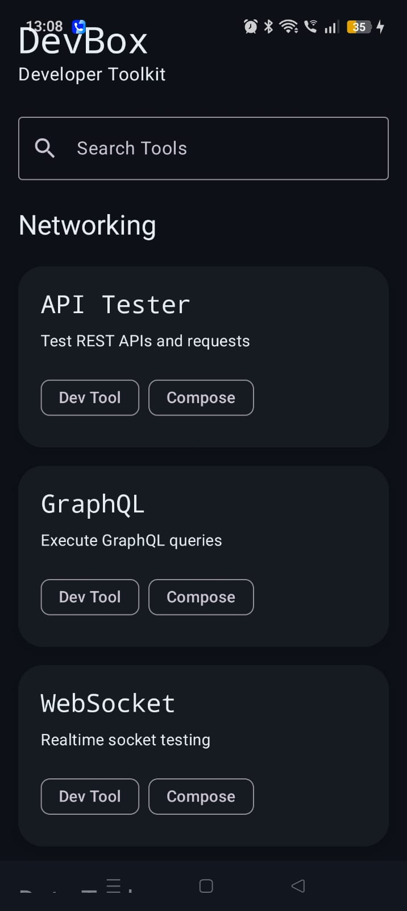
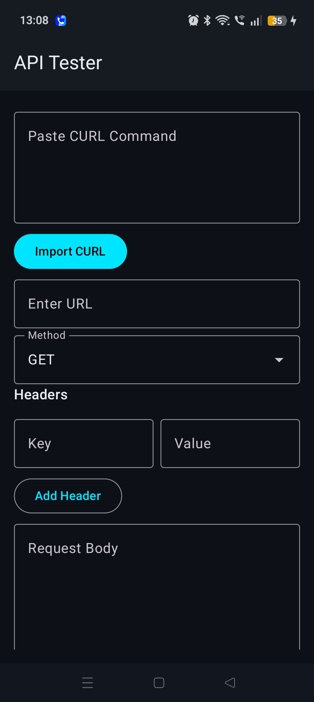
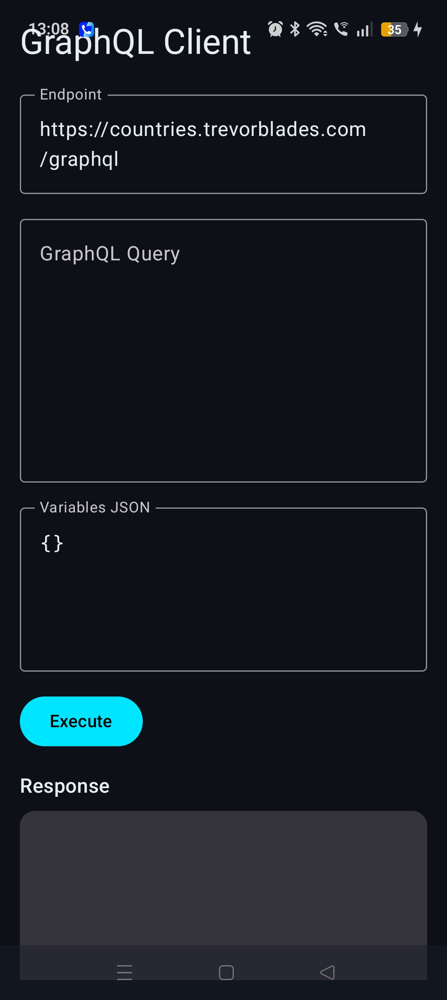
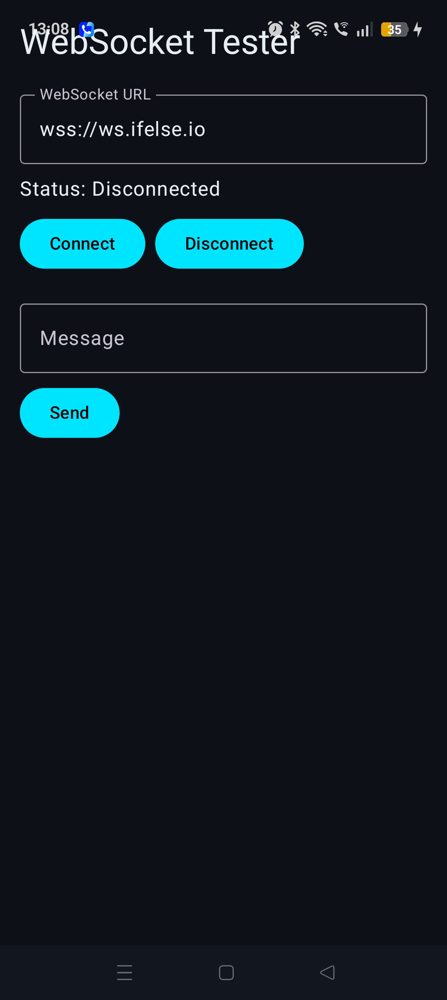
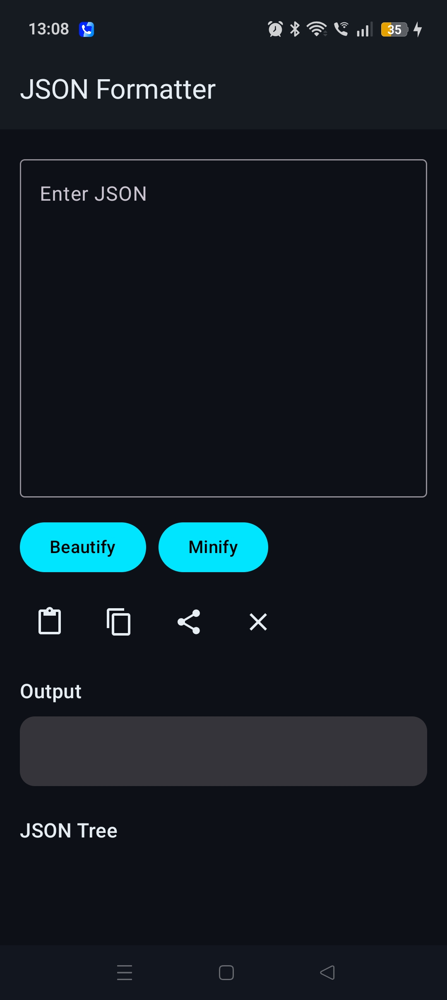
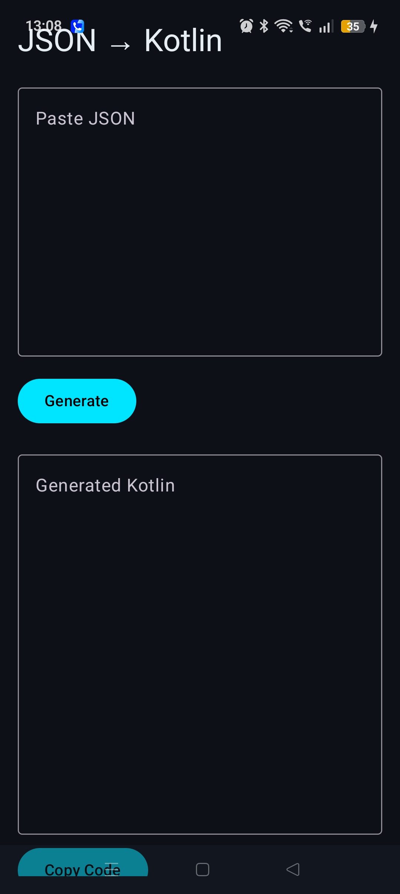
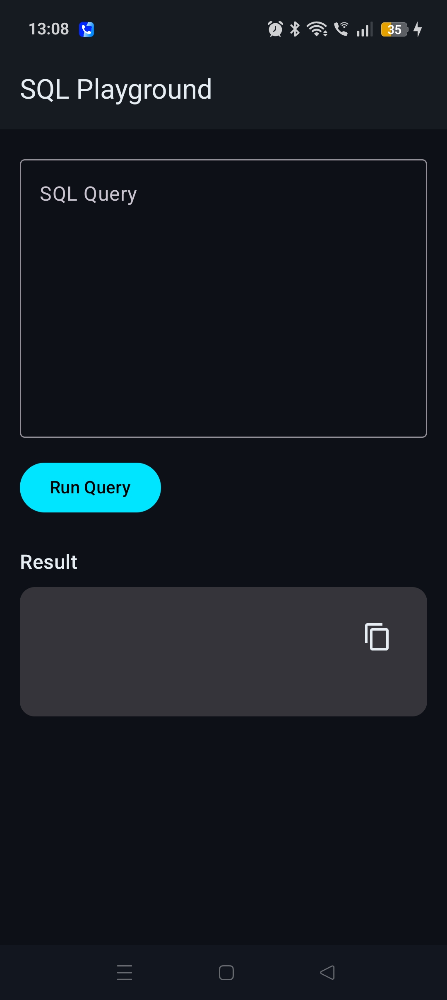
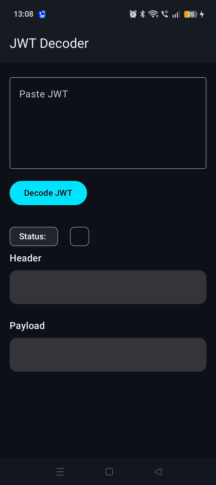
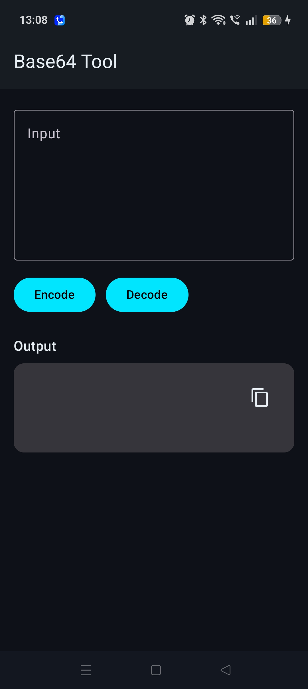

# DevBox

> A modern Android developer toolkit built with Jetpack Compose.

I always wanted to make a devtool which actually helps a person while developing something cool! So here it is my first devtool app presenting to all of you.. drum rolls..
DevBox! which is an all-in-one developer utility application focused on API testing, networking, JSON tooling, developer productivity, and debugging workflows directly on Android.

---

# Download

## Latest APK

[⬇ Download DevBox APK](https://github.com/Tanishq172006/devbox/releases/download/v1.0.0/app-release.apk)

---

# Features

## Networking Tools

### API Tester

* REST API testing
* GET / POST / PUT / DELETE support
* Custom request headers
* JSON request body editor
* CURL importer
* Request history
* Syntax highlighted JSON response viewer
* Response status and timing

### GraphQL Client

* Execute GraphQL queries
* Variables editor
* JSON response viewer
* Syntax highlighting

### WebSocket Tester

* Connect to WebSocket servers
* Send and receive live messages
* Realtime message viewer

---

## Data Tools

### JSON Formatter

* Beautify JSON
* Minify JSON
* Syntax highlighting
* Validation
* JSON Tree View

### JSON → Kotlin Generator

* Convert JSON into Kotlin data classes automatically
* Makes the product demands application easy

### SQL Playground

* Execute SQLite queries
* Dynamic table rendering
* Query result viewer

---

## Security Tools

### JWT Decoder

* Decode JWT tokens
* Expiration checker
* Valid / Expired status chips
* Header + payload viewer

### Base64 Tool

* Encode Base64
* Decode Base64

---

## Utility Tools

### Regex Playground

* Live regex matching
* Match highlighting
* Group extraction
* Regex presets

### Request History

* Stores API requests locally using Room Database
* Quickly revisit previous requests

---

# Tech Stack

## Android

* Kotlin
* Jetpack Compose
* Material 3
* Navigation Compose
* ViewModel
* Room Database

## Networking

* OkHttp
* Retrofit
* Gson

## Architecture

* MVVM
* Reusable UI components
* Shared syntax highlighting utilities
* Modular feature-based structure

---

# Screenshots


| Home Screen | API Tester |
|-------------|-------------|
|  |  |

| GraphQL | WebSocket |
|----------|------------|
|  |  |

| JSON Formatter | JSON → Kotlin |
|----------------|----------------|
|  |  |

| SQL Playground | JWT Decoder |
|----------------|-------------|
|  |  |

| Base64 Tool | Regex Playground |
|-------------|------------------|
|  |  |

| Request History |
|-----------------|
|  |

# Installation

## Clone Repository

```bash
git clone https://github.com/Tanishq172006/devbox.git
```

## Open in Android Studio

* Open Android Studio
* Select "Open"
* Choose the DevBox project

## Run

* Connect Android device or emulator
* Click Run

---

# Project Structure

```text
app/
 ├── core/
 ├── data/
 ├── features/
 │    ├── apitester/
 │    ├── graphql/
 │    ├── websocket/
 │    ├── jsonformatter/
 │    ├── regex/
 │    ├── sql/
 │    ├── jwt/
 │    ├── base64/
 │    └── history/
 ├── navigation/
 └── ui/
```

---

# UI & Design

DevBox uses:

* Dark developer-focused UI
* VSCode-inspired aesthetics
* Monospace typography
* Animated cards
* Syntax highlighted code blocks
* Cyberpunk-inspired accent colors

---

# Future Improvements

* Environment variables
* AI response explainer
* Saved collections
* Request replay
* Export/import requests
* GraphQL schema explorer
* WebSocket event formatter
* Favorites and pinned tools
* Developer dashboard widgets

---

# Why DevBox?

Most mobile developer utility apps focus on only one tool. BUT DevBox has it all in one place for you all! Would love to hear what else can i add in it and with time will be developing the UI too!

DevBox combines:

* API testing
* GraphQL
* JSON tooling
* SQL utilities
* JWT inspection
* Regex testing
* WebSocket debugging

into a single modern Android application.

---

# Author

Made with love by Tanishq Pandey

Android Developer | Kotlin | Jetpack Compose 

---

# License

MIT License
